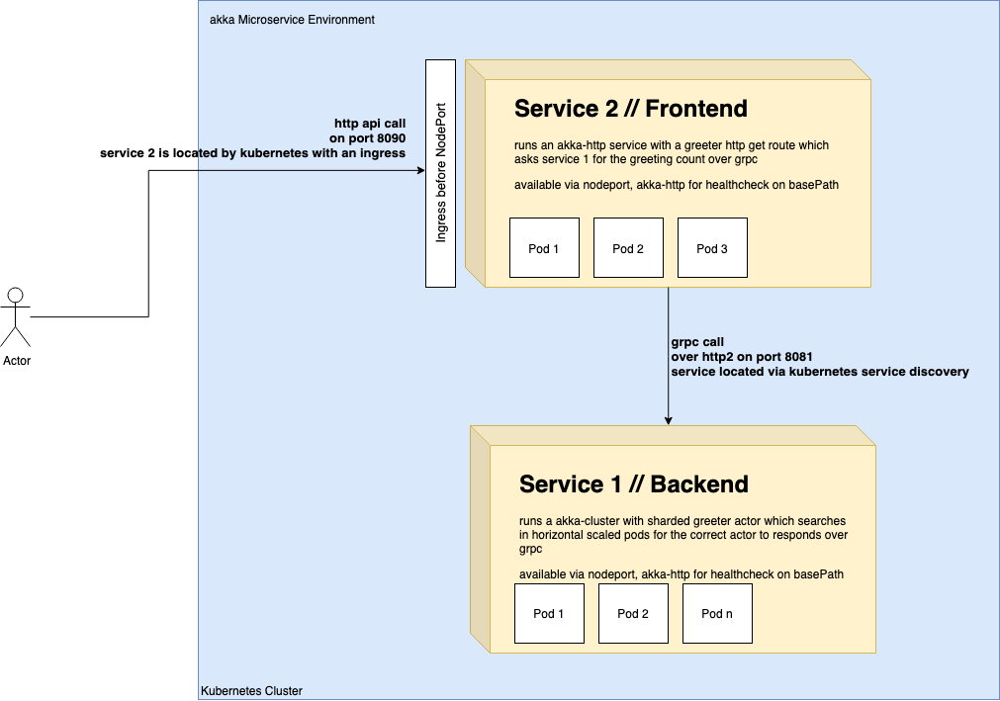

# akka-microservice-sample
This is a akka kubernetes deployment example.
It runs on minikube and uses the newest akka-management release and the sbt native packager for container creation.

- A backend service which starts a akka cluster on 3 nodes (pods) and counts the greeting count for a given name
- A frontend service which uses akka discovery to get the gRPC endpoint of service 1 to ask the cluster



## Quickstart

Steps to run the demo cluster:

- install minikube ```brew cask install minikube```
- configure docker eng in terminal ```eval $(minikube docker-env)```
- go to k8s folder ```cd k8s```
- run build script ```./build-images.sh```
- configure kubernetes cluster roles before first run ```kubectl apply -f rbac-init.yaml```
- run service 1 (backend) first ```kubectl apply -f service1.yaml```
- run service 2 (frontend) ```kubectl apply -f service2.yaml```
- get your minikube ip ```minikube ip```
- get the service port of your NodePort Service 2 ```kubectl get services```
- call you minikube ip on the given NodePort with your favorite browser -  The http result should be `Service 2 is ok`
    - if this doesn't work use ```minikube service service2``` which shows the URL you have to use and opens your favourite browser -  The http result in the browser should be `Service 2 is ok`
- call the get path greet with a name ```e.g http://192.168.99.100:32462/greet/innFactory``` -  The http result should be something like `Hello innFactory - The actorsystem greeted you 1 times!`

## Update service

Example for service1:

- make your code changes
- in the file ```service1/build.sbt``` update the ```version in Docker``` value to ```0.2``` for example
- go to k8s folder ```cd k8s```
- run build script ```./build-images.sh```
- rollout new version ```kubectl set image deployment/service1 service1=innfactory-test/service1:0.2```
- check the status of the deployment with ```kubectl get pods```

## Monitoring and Tracing

There are 3 branches with different tools for monitoring and tracing:
- branch ```lightbend_monitoring```: Simple Monitoring example with Lightbend Monitoring.
- branch ```kamon_jaeger```: Monitoring example with Kamon and tracing example with Jaeger .
- branch ```istio```: Example Istio integration.

## Notes

ServiceDiscovery is made with akka discovery and a bit dirty, because it does not use the cluster ip of service 1 for the grpc calls.
It just tooks the first resolution address from the pod list with selector app=service1 and blocks service2 with Await. For a production use-case this should be changed and the the grpc client binding should use the result of the kubernetes-api-discovery from future and not from Await with hard .get!!!. 
Logging is also very dirty and there are a lot of println.

## Blogpost

soon on medium

## Contributors

-   [Tobias Jonas](https://github.com/jona7o)
-   [Michael List](https://github.com/Michael-List)

[innFactory - Cloud Engineering Experts - akka, grpc, k8s, kubernetes](https://innfactory.de/)
